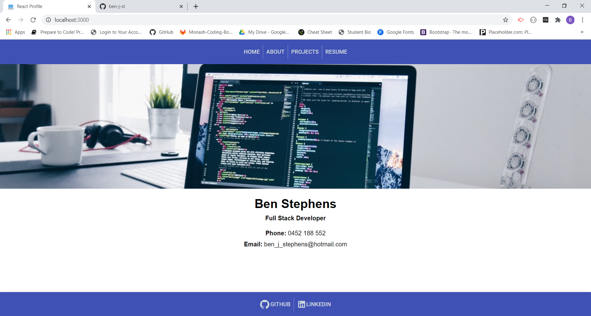

# React Profile

    

## Description 

A React based profile to display newly utilized skills in working with the material ui framework and incorporating that into a react website, so that the content is updated without refreshing the page making the whole application feel much smoother 

## Links

<a href="">Live Github Version</a>

## Table of Contents

* [Description](#Description)
* [Installation](#Installation)
* [Usage](#Usage)
* [Licence](#Licence)
* [Contributing](#Contributing)
* [Tests](#Tests)
* [Questions](#Questions)
* [Screenshot](#Screenshot)
* [Walkthrough](#Walkthrough-video)

## Installation

Run npx create-react-app employee-directory locally and replace the src folder with this project's src.

## Usage

Use npm start to run application

## Licence 

MIT

A short and simple permissive license with conditions only requiring preservation of copyright and license notices. Licensed works, modifications, and larger works may be distributed under different terms and without source code. see full licence at https://choosealicense.com/licenses/mit/

## Contributing 

was built based on specifications from trilogy.

## Tests

none at this time

## Questions

Github Username: <a href="https://github.com/ben-j-st">ben-j-st</a>

Email: ben_j_stephens@hotmail.com

## Screenshot 

 

